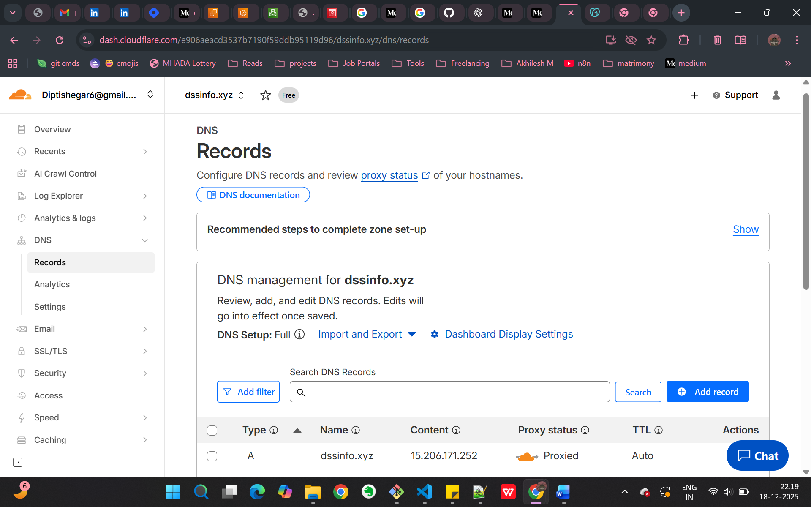
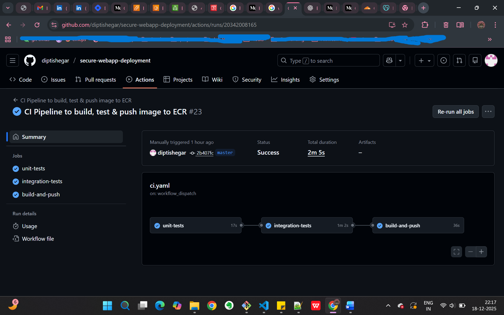
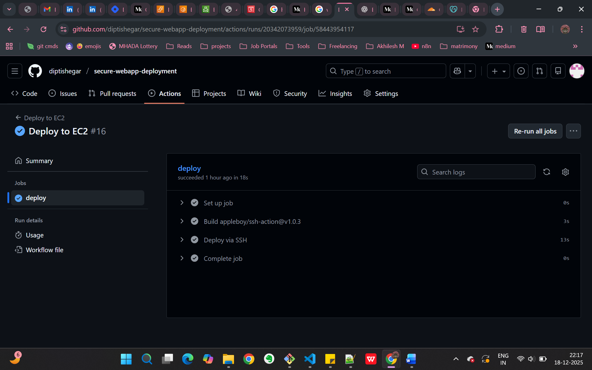
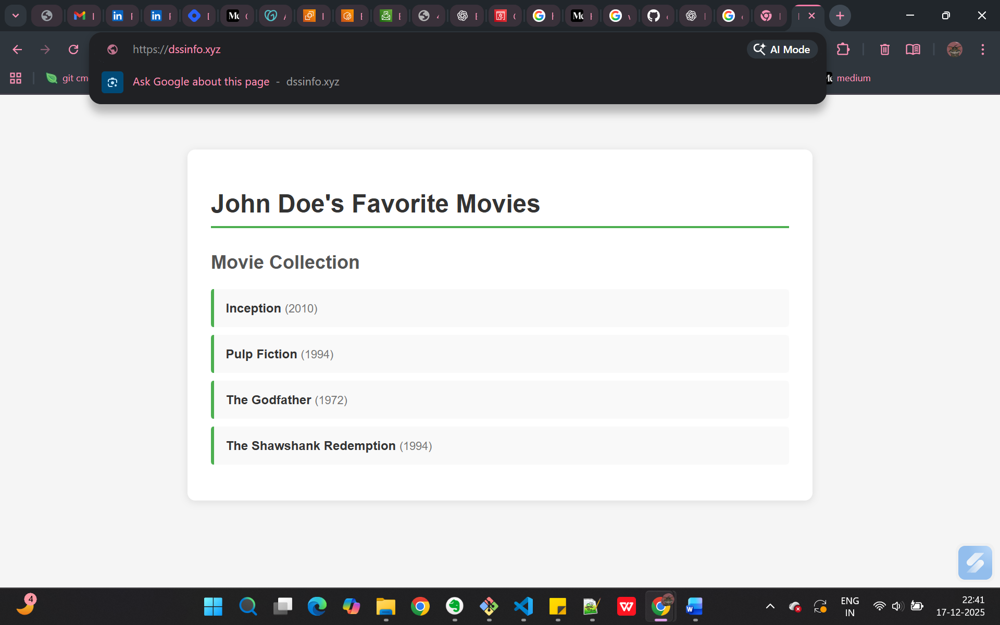

### Deploy application using AWS EC2, Docker, Nginx, securely using SSL/TLS certificate, Cloudflare | End-to-end automated CI/CD setup with Github Actions.

📍 **Project Objective :** _Deploy a python application using real-world approach securely on AWS EC2 & automating CI/CD using Github Actions._
_The application is exposed through Nginx as a reverse proxy, mapped to a custom domain using GoDaddy, and secured with Cloudflare for HTTPS traffic only, DNS protection, and traffic filtering. The setup focuses on security, scalability, and production-grade access patterns commonly used in real deployments._

💡 Key Learnings :

* Real-world CI/CD pipeline design
* Docker-based deployment
* Debugging authentication & deployment issues
* Secrets handling in CI/CD pipeline
* Hosting application using SSL/TLS with Cloudflare

🛠️ Technologies/Tools used :

* AWS : Networking, Compute, Firewall, IAM policies, roles, ECR
* Github Actions for CI/CD automation
* Docker Containers, docker-compose
* Cloudflare (free)
* Nginx as Reverse Proxy
* GoDaddy domain name (paid)

📈 Final Outcome :

* Application code is Tested & Verfied before deployment
* Fully automated deployment
* Zero manual Docker/SSH commands
* Web application accessible through secure HTTPS protocol

Best Practices :
* SSL termination at Cloudflare
* NGINX as reverse proxy
* Docker app bound to localhost only
* No certs stored on EC2
* Cloudflare handles HTTPS, HSTS, WAF

**Snapshots :**
1. Cloudflare DNS Record configuration \

2. CI Github Actions workflow \

3. CD Github Actions workflow \

4. Website hosted on Godaddy domain (https://dssinfo.xyz) \
